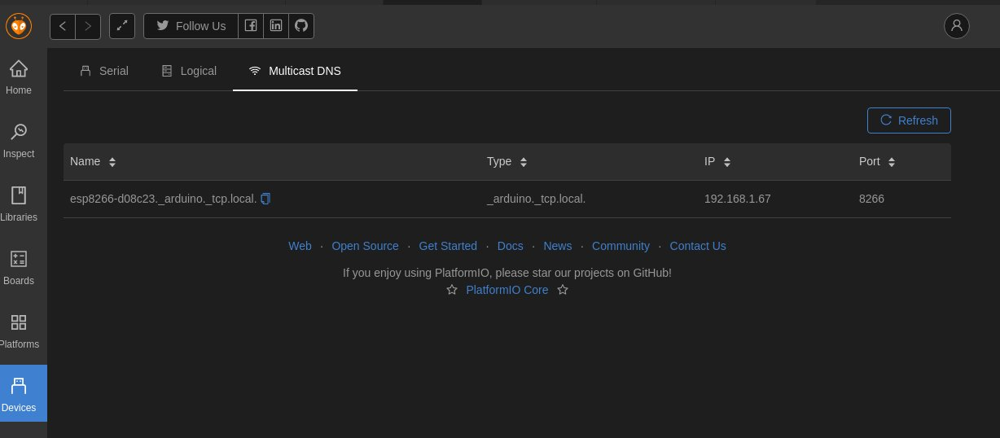

# Setting Up OTA

OTA or Over The Air programming allows the ESP8266 to be updated remotely, rather than via the USB port. This is convenient, especially as my ESP8266 will probably be installed in the back of a cupboard in the carvan and I don't want to have to take my laptop and pul in every time I want to try something.

There is an example ArduinoOTA for the ESP8266 so I'll start there and see what happens. The example code is very basic and doesn't explain how to use it or how it interacts with the application code running on the ESP. [This](https://randomnerdtutorials.com/esp8266-ota-updates-with-arduino-ide-over-the-air/) blog posts runs through the steps to start using OTA.

After following these instructions I could upload from the Arduino IDE. Also, the esp was showing up in PIO devices list on the PIO home.



First attempt at upload from PIO failed with

```
21:12:31 [DEBUG]: Options: {'esp_ip': '192.168.1.67', 'host_ip': '0.0.0.0', 'esp_port': 8266, 'host_port': 45921, 'auth': '', 'image': '.pio/build/esp01/firmware.bin', 'spiffs': False, 'debug': True, 'progress': True}
21:12:31 [INFO]: Starting on 0.0.0.0:45921
21:12:31 [INFO]: Upload size: 314928
21:12:31 [INFO]: Sending invitation to: 192.168.1.67
21:12:31 [ERROR]: Bad Answer: ERR: ERROR[4]: Not Enough Space
```

Attempting the same upload from the Arduino IDE resulted in the error, consistency is a good thing...

There is a handy example sketch called 'CheckFlashConfig'. After running this on my chip and enabling serial monitor the following was displayed

```
Flash ide  size: 4194304 bytes
Flash ide speed: 40000000 Hz
Flash ide mode:  DIO
Flash Chip configuration ok.
```

Which indicates to me I have 4MiB available, plenty to do OTA. [This](https://www.esp8266.com/viewtopic.php?f=8&t=16924&start=4) post looks like my problem but didn't solve it and the above shows I have 4MiB. When uploading the Arduino IDE displays

```
Sketch uses 251252 bytes (24%) of program storage space. Maximum is 1044464 bytes.
Global variables use 28140 bytes (34%) of dynamic memory, leaving 53780 bytes for local variables. Maximum is 81920 bytes.
```

which indicates 1MiB for program storage, so should be good.

When PIO does a build it indicates

```
DATA:    [===       ]  34.1% (used 27948 bytes from 81920 bytes)
PROGRAM: [=======   ]  71.6% (used 310768 bytes from 434160 bytes)
```

which is different, suggesting a lot less available RAM.

After trying a few different settings and getting the same results from the Arduino IDE as the VS Code plug I ordered a couple of ESP32s from [Ali Express](https://www.aliexpress.com/item/4000373163955.html?spm=a2g0o.productlist.0.0.40e2190e0OXBvt&algo_pvid=d37028e8-f042-4c05-95a6-c25f9f678b57&algo_expid=d37028e8-f042-4c05-95a6-c25f9f678b57-5&btsid=d6af54fc-21af-44fb-a956-9d339099a9ef&ws_ab_test=searchweb0_0,searchweb201602_10,searchweb201603_55) and will continue investigating OTA once they arrive.


...end...
