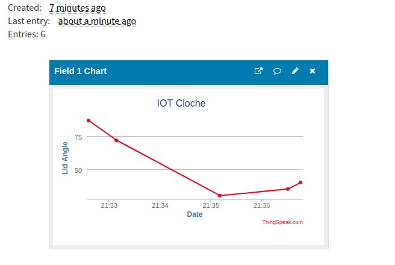

# Dashboarding

There are uncountable IoT platforms and choosing one is always going to be a problem. My current criteria are fairly simple
1. Must be free
1. Must have a simple HTTP POST API
1. Must have some built in dashboard capabilities

At some point I'll take at a deeper look at GCP, Azure and Amazon as I've played with all three of them but they are more capable and complex and I need right now.

[Thinger.io](http://thinger.io) was the first search result and it looked good, the photos showed pictures of ESPs, but no free/trial account.

Next up was [ThingSpeak](http://thingspeak.com) which does have a free, non-commercial account. Judging by the contents of the 'Public Channels' it has some dashboarding capabilities. In amongst the examples was a ESP8266 pushing temperature readings using an HTTP API.

ThingSpeak gets three ticks so here goes.

# The Code

After signing up, creating a channel and a simple graph visualization I obtained the API key and the sample HTTP request.

```
https://api.thingspeak.com/update?api_key=xx12E35F4LBS3PDO&field1=30
```

Lesson 1: renaming the field in the UI doesn't rename it in the API

Lesson 2: If the response to the get request is '0' your exceeding the message rate and the request is ignored. The free license supports a message every 15s.



Very easy, the code is a very simple extension to the hmc5883l.cpp in the utilities folder and can be viewed [here](../../src/utilities/hmc5883l.cpp)

...end...