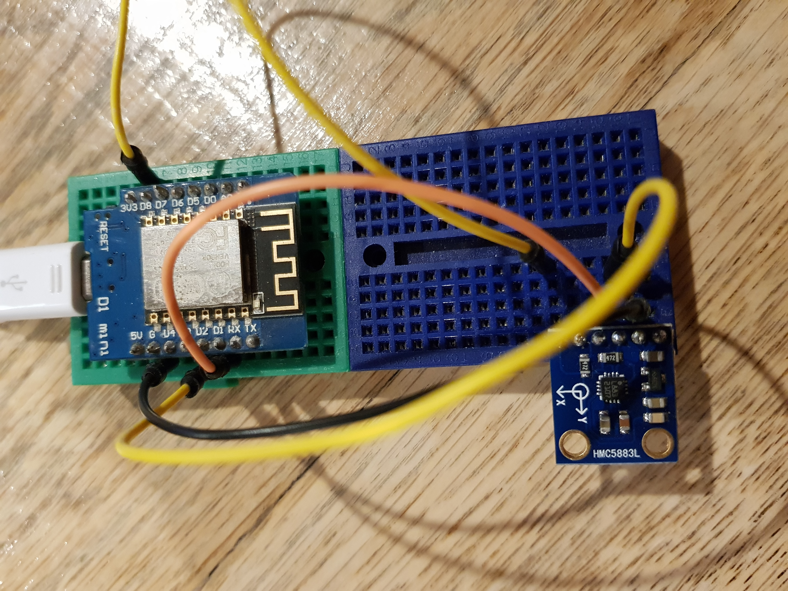
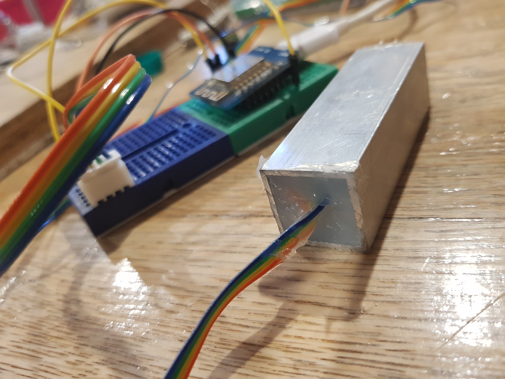

# Cloche Lid Monitoring

While gathering tools and hardware to progress with the temperature monitoring step I found a digital gyro board I had bought for another project and never used. It occurred to me that knowing the angle the lid of the cloche was sitting at would be much more interesting that a binary open/closed that a micro-switch would supply so I stopped working on temperature sensors, which are rather boring, and set up the gyro.

## Hardware

The [HMC5883L](https://cdn-shop.adafruit.com/datasheets/HMC5883L_3-Axis_Digital_Compass_IC.pdf) is a 3-Axis digital compass. It contains multiple magneto sensors, ADCs and it supports I2C, making it easy to connect.

This is the set up on a couple of small prototype boards. I didn't add any pull-up resistors to the SDA and SCL pins so I'm not convinced it's going to work first time, but we'll see.



## Connecting

First step in proving the connection is to use the [i2c_scanner](../../src/utilities/i2c_scanner.cpp) to see if the device is on the bus.

```
I2C Scanner to scan for devices on each port pair D0 to D7
Scanning (SDA : SCL) - GPIO16 : GPIO5 - No I2C devices found
...
<<snip>>
...
Scanning (SDA : SCL) - GPIO5 : GPIO16 - No I2C devices found
Scanning (SDA : SCL) - GPIO5 : GPIO4 - I2C device found at address 0x1E  !
**********************************

Scanning (SDA : SCL) - GPIO5 : GPIO0 - No I2C devices found
```

First time and the device is found. If you examine the wiring on the prototype board you'll see that, even though the scanner reports GPIO5 and GPIO6 we're connected to D1 and D2.

## Gyro readings

The HMC5883L is a sophisticated little chip, complete with a self-test on start-up where is induces is own, internal magnetic field.

Reading the data sheet you'll there are a number of external components required but I'm using a [carrier board](https://www.aliexpress.com/item/32826264150.html?spm=a2g0o.productlist.0.0.4a3877489GrqkC&algo_pvid=d35c0a8b-303a-4f29-965e-2f9b1260ca8a&algo_expid=d35c0a8b-303a-4f29-965e-2f9b1260ca8a-0&btsid=759ead3d-bcdd-4250-9409-d4127f5ab8cc&ws_ab_test=searchweb0_0,searchweb201602_1,searchweb201603_53) that already has these on it so it's easy.

After a bit of debugging because I transposed the SDA and SCL pins in the Wire.Begin call I had the position stream in via the serial port. The code is available [here](../../src/utilities/hmc5883l.cpp). It needs some work, but it functional (and copied, in parts from other places).

The important part is that the X axis varies as a move the board

```
x: 65357  y: 65528  z: 61440
x: 65393  y: 65520  z: 61440
x: 65522  y: 65520  z: 61440
x: 105  y: 65498  z: 61440
x: 247  y: 65475  z: 61440
x: 353  y: 65484  z: 61440
x: 406  y: 65501  z: 61440
x: 456  y: 65503  z: 61440
x: 480  y: 65508  z: 61440
x: 480  y: 65501  z: 61440
```

Around the 65,275 mark is horizontal, 540 is vertical. The Z axis never changes, even when I wave my battery drill around near the sensor, which means it's not working, but for my purposes this is perfect.

## Mounting

The mounting needs to be waterproof so I'll use a short piece of aluminum box section filled with silicon, add a long 4 wire tail to it and the first cloche sensor should be good to go.



...end...