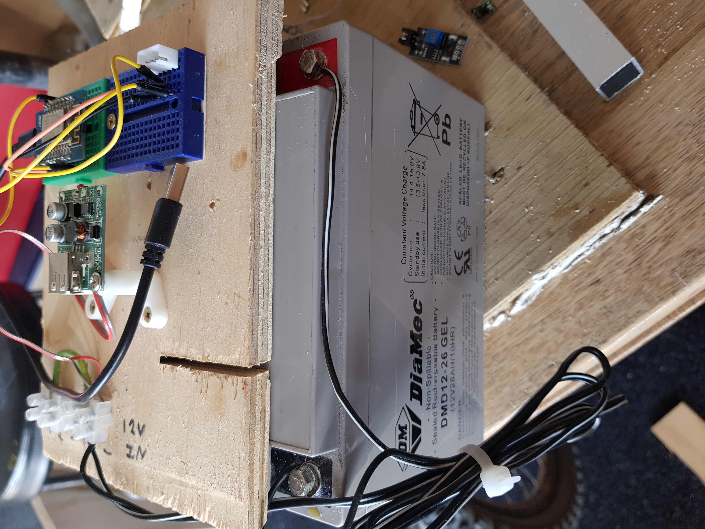
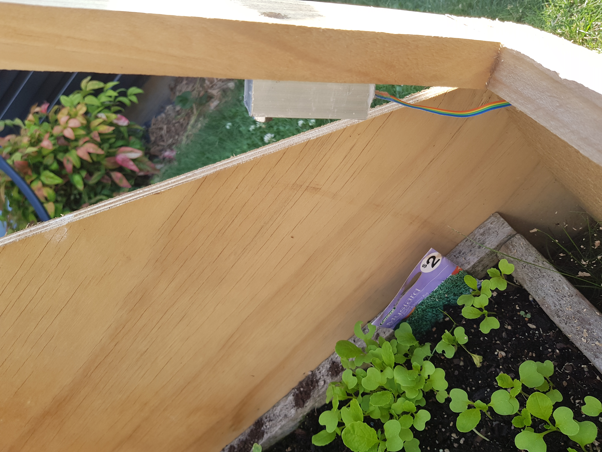

# First Successful Day

The installation of the sensor, at least for the first version, involves drilling a hole and finding a battery.

The power supply for the system is a 26AH12V battery and a 12V usb adapter.

The senors is bolted onto the lid frame with the tail running back to the ESP.

After a couple of test runs and recalibration everything looks like to working.

...end...