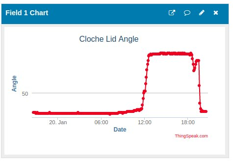

# First Successful Day

After a couple of attempts over the last few days the lid angle monitoring is working, upload the measurement to [ThingSpeak](thingspeask.com) every five minutes, which is probably too frequent but it works.

The dashboard looks like this  
.

The day started out cloudy and misty so didn't warm up until mid day. There was a cool breeze and some clouds around 1830. It warmed up again and the irrigation came on at 1930, resulting the in lid closing completely.

Final code for this version is [here](https://github.com/ScollyNZ/rv_solar_monitor/tree/v1.0.0.0)
...end...