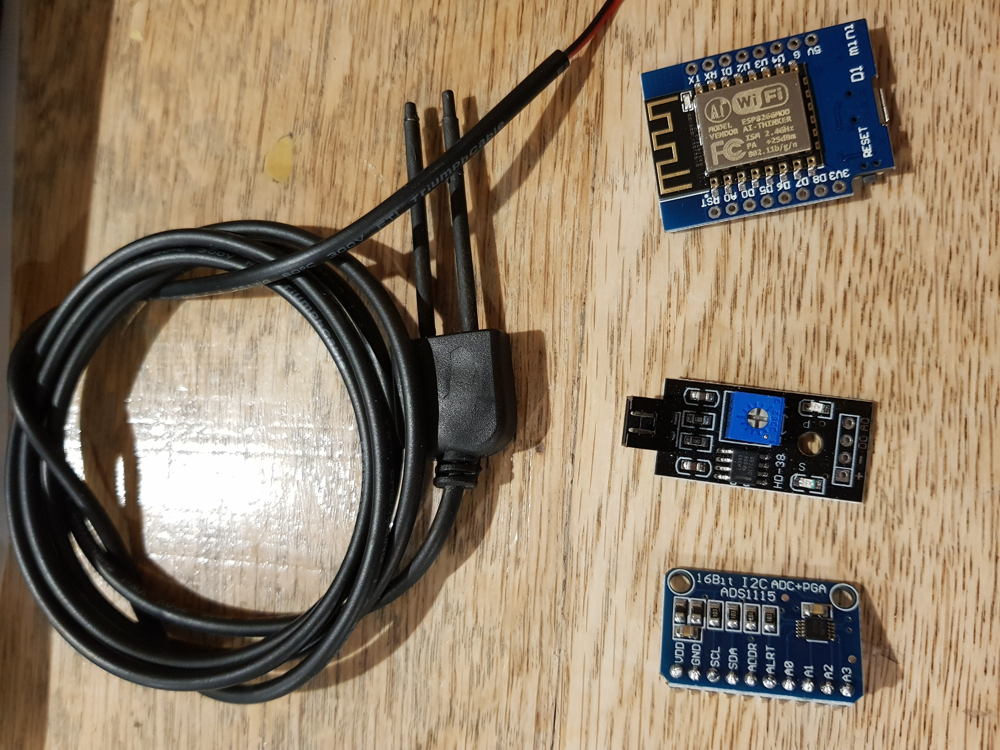
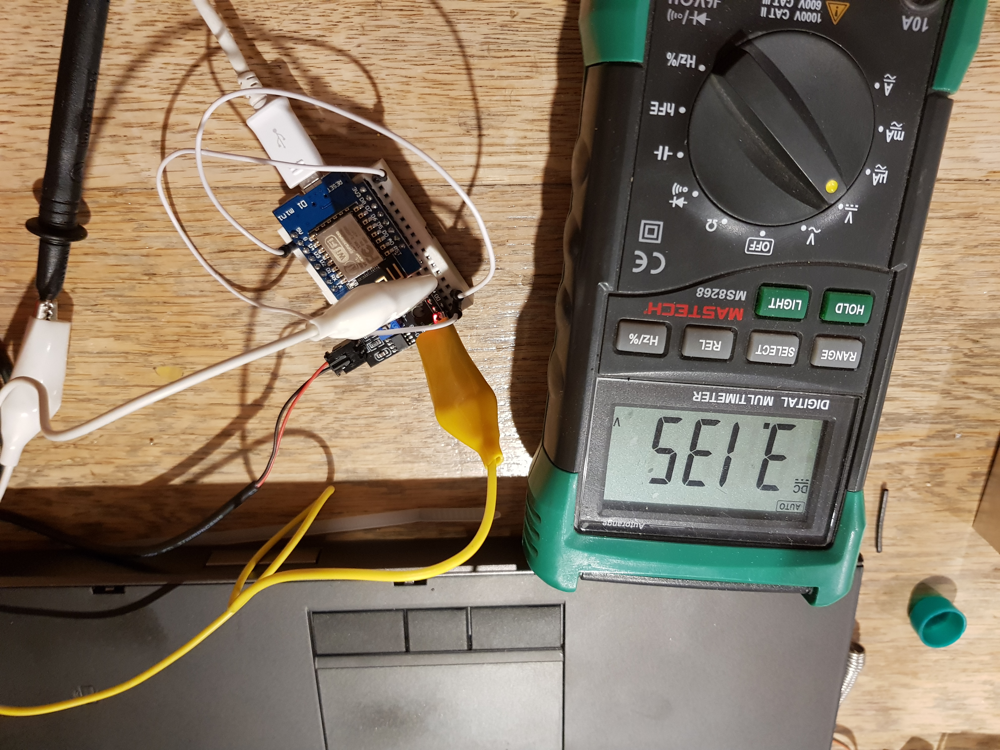

# Soil Moisture - Step 1

I recently upgraded the cloche with a set of mister heads. There are now 6 mister heads along the back wall of the cloche keeping the seedlings moist. This has significantly reduced the mortality rate but I'm fairly sure I'm over watering.

Step one of soil moisture is monitoring it. Steps two and three are to control it and then to measure water usage.

Control will consist of a water solenoid to turn on the mister heads under two scenarios  
1. When the soil is too dy, probably at a given time of the day, rather than at random
1. When the temperature in the cloche rises above preset value.

## Moisture Monitoring

A quick visit to Ali Express identified a couple of required components. The first is [the sensor itself](https://www.aliexpress.com/item/32951556560.html?spm=a2g0s.9042311.0.0.27424c4dlyeWmX) which is a fairly simple probe and op-amp arrangement. It also has a digital output that can be triggered by a pre-set value.

The second issue is that the ESP8266 Mini D1, that I'm using, has only 1 analog input port. This is also an issue on the solar monitor project. Turns out this is a solved problem, the solution being an I2C enabled ADC known as the ADS1115. It, also, is [available on Ali Express](https://www.aliexpress.com/item/1656318134.html?spm=a2g0s.9042311.0.0.7f994c4dnzknWT).



[This](https://github.com/addicore/ADS1115/blob/master/ADS1115.cpp) looks like a well document class for interfacing with the ADC but first I need to investigate the soil moisture probe as it comes with no documentation at all.

## Moisture Sensor

A quick test rig using a prototype board and an ESP as a 3v3 power supply showed all was working as expected. The multi-meter showed the voltage difference between the 3v3 rail and the A0 pin as follows

|Contact|Voltage|
|---|---|
|Nothing|0.0v|
|Dry Fingers|0.6v|
|Wet Surface|3.2v|



The ADS1115 has a selectable range option, according to the [datasheet](https://www.ti.com/lit/ds/symlink/ads1115.pdf), from 256mv to 6.1v in 6 steps.

The datasheet states

```
Analoginputvoltagesmustneverexceedthe analoginputvoltagelimitsgivenin theAbsoluteMaximumRatings.If a VDDsupplyvoltagegreaterthan4 V is used,the ±6.144V full-scalerangeallowsinputvoltagesto extendupto the supply.Althoughin this case(or wheneverthe supplyvoltageis less thanthe full-scalerange;for example,VDD= 3.3 V and full-scalerange= ±4.096V), a full-scaleADCoutputcodecannotbe obtained.For example,with VDD= 3.3 V and FSR= ±4.096V, only signalsup to VIN= ±3.3 V can be measured.The coderangethatrepresentsvoltages|VIN| > 3.3 V is not usedin this case.
```

Since I'm using 3v3 the 4.096 setting is the one to go for, giving access to maximum range.

...end...